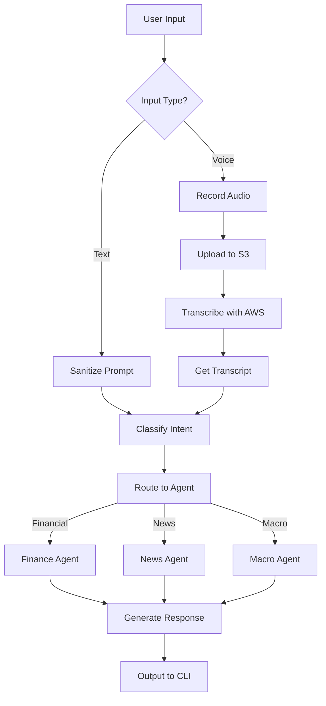
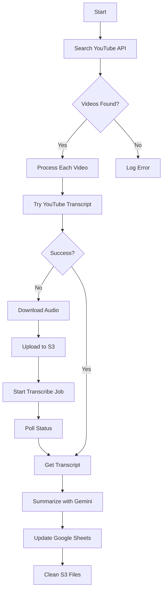
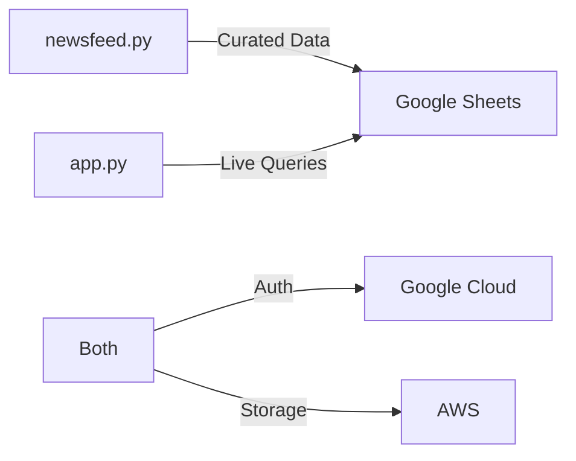

# 🧠 Financial Analysis & Stock Orchestration System

A comprehensive multi-agent intelligent system for financial data analysis, stock evaluation, and economic insights with support for both text and voice inputs. Built using the [Phi Framework](https://docs.phi.ai), LLaMA-4, AWS services, Google's Gemini AI, and more.

## 🚀 Features

- 💹 Analyst insights with recommendation tables  
- 📈 Portfolio strategy guidance (Buy / Hold / Sell)  
- 📰 Latest news aggregation with sources  
- 🧠 Sentiment analysis from headlines  
- ⚠️ Risk analysis from financial fundamentals & news  
- 🎤 Voice input support through AWS Transcribe
- 🤖 Intent classification via Google's Gemini AI
- 🔒 Prompt injection protection and secure .env integration  
- 📊 Economic data retrieval from World Bank
- 📱 Modular, agent-based architecture

## 🧱 System Architecture

The system consists of two main components:

### 1️⃣ Client Application (`app.py`)

Handles user interactions with support for text and voice inputs.

#### Workflow:


1. **Input Handling**:
   - Accepts text input directly
   - Records voice input using `sounddevice` (WAV format)

2. **Voice Processing Pipeline**:
   - Uploads audio to AWS S3
   - Processes with AWS Transcribe
   - Retrieves JSON transcript

3. **Intent Classification**:
   - Uses Gemini to analyze and classify user requests
   - Routes to appropriate specialized agent

4. **Specialized Agents**:
   - Financial Agent: Stock analysis using YFinance
   - News Agent: Information from NewsAPI and YouTube
   - Macro Agent: Economic data from World Bank

### 2️⃣ Server Backend (`newsfeed.py`)

Automatic news aggregation and processing pipeline that runs scheduled tasks.

#### Workflow:


1. **Scheduling**:
   - Runs hourly via the `schedule` library
   - Immediate first run with 60-second polling interval

2. **Content Discovery**:
   - Searches YouTube API for relevant videos
   - Processes each video individually

3. **Transcription Pipeline**:
   - Attempts to retrieve native YouTube captions
   - Falls back to downloading audio if needed
   - Uploads to S3 and processes with AWS Transcribe

4. **Content Processing**:
   - Summarizes transcripts using Gemini
   - Updates Google Sheets with results
   - Cleans up temporary S3 files

## ⚙️ Core Technologies

- **Framework:** [`phi`](https://github.com/blackjax-dev/phi)
- **Models:**
  - `Groq` with `meta-llama/llama-4-scout-17b-16e-instruct` (analysis agents)
  - `Google Gemini 1.5 Flash` (intent classification)
- **Environment Loader:** `dotenv` for secure API key handling
- **AWS Services:**
  - `Amazon S3` for audio file storage
  - `Amazon Transcribe` for speech-to-text conversion

## 🧰 Tools & Integrations

| Tool           | Purpose                                   |
|----------------|-------------------------------------------|
| `YFinanceTools`| Analyst data, fundamentals, news, pricing |
| `DuckDuckGo`   | Public news search, sentiment inputs      |
| `NewsAPI`      | Current events and financial news         |
| `World Bank API`| Economic data and indicators             |
| `YouTube API`  | Video content for news aggregation        |
| `AWS S3`       | Audio file storage                        |
| `AWS Transcribe`| Speech-to-text conversion                |
| `Google Sheets`| Data persistence and sharing              |
| `Gemini AI`    | Intent classification & summarization     |

## 🤖 Agents

| Agent Name               | Role Description                                                                 |
|--------------------------|----------------------------------------------------------------------------------|
| 📊 `Finance Agent`       | Fetches latest analyst recommendations & fundamentals (tables preferred)         |
| 🧠 `Sentiment Agent`     | Analyzes tone of company news and classifies it (positive/negative/neutral)      |
| ⚠️ `Risk Agent`          | Identifies red flags from financials/news (e.g. debt, lawsuits, scandals)        |
| 📰 `News Agent`          | Retrieves most recent public news from NewsAPI and YouTube                       |
| 📈 `Portfolio Strategy Agent` | Suggests BUY / HOLD / SELL with reasoning and approximate allocations       |
| 🌍 `Macro Agent`         | Analyzes economic data from World Bank                                           |
| 🔍 `Intent Classifier`   | Uses Gemini to detect company name and analysis type from user input             |

## 🔐 Security Measures

- **Prompt Sanitization:** Blocks injection patterns like `ignore`, `system`, `shutdown`, etc.
- **.env Integration:** API keys securely managed using environment variables
- **Neutralized Input:** Regex filters applied to sanitize all user queries

## 📝 Environment Variables

Create a `.env` file with the following variables:

```
# AWS Configuration
AWS_ACCESS_KEY_ID=your_aws_access_key
AWS_SECRET_ACCESS_KEY=your_aws_secret_key
AWS_REGION=us-east-1
S3_BUCKET_NAME=your_s3_bucket_name

# Google APIs
GEMINI_API_KEY=your_gemini_api_key
YOUTUBE_API_KEY=your_youtube_api_key
GOOGLE_SHEETS_CREDENTIALS=path_to_credentials.json

# News API
NEWS_API_KEY=your_newsapi_key

# LLM APIs
GROQ_API_KEY=your_groq_api_key
```

## 📦 Installation

```bash
# Clone the repository
git clone https://github.com/your-username/financial-analysis-system.git
cd financial-analysis-system

# Install dependencies
pip install -r requirements.txt
```

## 🚀 Usage

### Client Application

```bash
# Run the client application
python app.py
```

#### Text Input Example:
```
Your query: Should I buy Apple stock?
```

#### Voice Input Example:
```
Your query: voice
🎤 Recording for 5 seconds...
🎤 You said: What's the latest news about Tesla?
```

### Server Backend

```bash
# Run the news aggregation service
python newsfeed.py
```

The script will automatically start scheduled processing.

## 📋 Requirements

```
phi
groq
google-generativeai
python-dotenv
yfinance
duckduckgo-search
newsapi-python
boto3
sounddevice
numpy
wave
schedule
requests
google-api-python-client
google-auth-httplib2
google-auth-oauthlib
```

## 🔄 System Integration

Both components share infrastructure:


This architecture enables real-time synchronization while maintaining separation of concerns.

## 🎥 Resources

[Watch the Stock Analysis Demo on YouTube](https://youtu.be/BtW9i3CL5KY?si=DOT8iW__zPwX9TWx)

## 📄 License

[MIT License](LICENSE)
